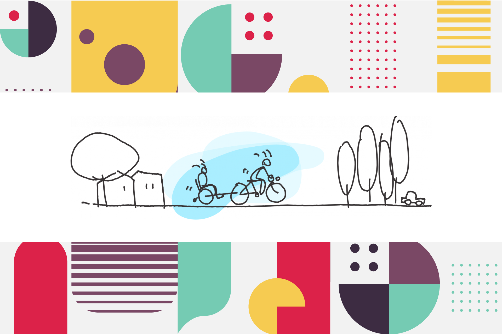

Conectar a las personas con su entorno, escucharlas e involucrarlas usando la
cultura y la creatividad como medios de progreso es tendencia y por tanto es
futuro.

Las políticas participativas que se vienen practicando en Puerto de la
Cruz, con la sostenibilidad como punto de enfoque y centradas en la calidad de
las experiencias, están en consonancia con la Nueva Bauhaus y las directrices en
Europa para un futuro más bien inmediato. Tremenda sorpresa nos hemos llevado.

Se trata de un programa impulsado desde la Unión Europea, presentado este mismo
año 2021, que destaca por la centralidad de la cultura como elemento
cohesionador del continente y que llama a la ciudadanía a participar en el
desarrollo de proyectos que mejoren los espacios y la vida en las ciudades para
"construir entre todos un futuro sostenible e inclusivo", según anunció la
presidente de la Comisión Europea, Ursula von der Leyen.

## Escuela de la Bauhaus

El programa se propone recuperar conceptualmente el espíritu de la Escuela de
arte y arquitectura de la Bauhaus, de ahí su nombre, creada en Weimar, Alemania,
en 1919.

Tras el trauma que la Primera Guerra Mundial provocó en toda Europa, sus
fundadores pensaron que a través de la arquitectura se podía, y se debía,
mejorar la vida de las personas; y que uniendo la estética y la funcionalidad
los artistas (muchos de ellos son los que hoy llamaríamos diseñadores...) y los
arquitectos ayudarían a superar la crisis social que se cernía sobre el
continente durante la posguerra.

El legado de la Bauhaus es enorme: el diseño como parte de la vida cotidiana, el diseño industrial y la función social de la arquitectura son algunas de sus huellas más destacadas en la sociedad contemporánea.
Pero es precisamente ese espíritu de reconstrucción, con algo de utopía social, el que retoma esta Nueva Bauhaus. Y lo hace para animarnos a participar en la creación de nuevos espacios y modos de pensar. También vemos ideas de la Bauhaus original en aquello de que la estética y la funcionalidad no solo no están reñidas, sino que se alimentan mutuamente; y en la intención de romper las barreras que puedan existir entre los creadores y la ciudadanía, puesto que se trata de un programa fundamentalmente participativo que apela a un amplio abanico de creadores: diseñadores, arquitectos, ingenieros, científicos, estudiantes y mentes creativas de todas las disciplinas que se juntarán para imaginar una vida sostenible posible y actual, fundamento para nuestro futuro inmediato.

## La Nueva Europa

Tras la crisis de la COVID-19 hay que trabajar por la recuperación social y
económica, así que la cuestión de cómo queremos que sea ese futuro pos-pandemia
es de vital importancia y una oportunidad única para construir algo nuevo, crear
una nueva sociedad, nuevas actitudes.

La pregunta que se nos plantea desde la Nueva Bauhaus Europea para empezar es:
¿cuál sería el nuevo edificio ideal? Para después tirar de ese hilo y seguir
imaginando cómo serían unos lugares hermosos, sostenibles e inclusivos.

¿A qué sentimientos y sensaciones atenderíamos? Pero también ¿qué requisitos
prácticos y materiales tendrían que cumplir? Si fuera nuestro barrio ¿qué
aspecto tendría, qué sensaciones produciría, cómo funcionaría? ¿Cómo
compartiríamos el espacio y cuáles serían nuestros nuevos hábitos? ¿Y si los
nuevos edificios fueran naves espaciales? ¿Y si fueran nidos de pájaros, flores,
árboles?

Los entornos deben ser hermosos para que la gente los viva. Y también deben ser
sostenibles, inclusivos, accesibles para todos y, además, los procesos para
desarrollarlos tienen que ser participativos. La Nueva Bauhaus quiere insistir
en el valor de la sencillez, la economía circular y la funcionalidad sin que
haya que renunciar a la comodidad y la belleza en la vida diaria.

Esta iniciativa se conecta con otras de la Unión Europea, como el Pacto Verde y
la Agenda Urbana, entre otras muchas relacionadas con el desarrollo urbano, la
eficiencia energética, la sostenibilidad, la neutralidad climática... Pero se
distingue de las demás en varias cosas importantes: una de ellas es que está
abierta a que todo el mundo envíe sus ideas; y no solo ideas de futuro, también
se pueden aportar ejemplos de cosas bien hechas que ya funcionan, hoy, aquí
mismo.

Esta es la primera fase del proyecto, la de codiseño. Aquí se inicia la
conversación y se forma la comunidad. Se puede participar hasta el final de
junio de 2021 compartiendo ideas, mostrando proyectos inspiradores o
recomendando materiales, productos, servicios, espacios, prácticas y edificios
contemporáneos que sean ejemplo de una vida digna de un futuro mejor.

La segunda fase promete ser aún más apasionante buscando las vías para ponerse
en marcha de una forma práctica. Esta fase de resultados, que empieza en
septiembre de 2021, se centrará en la puesta en práctica de proyectos piloto y
en la convocatoria de propuestas específicas, con programas de seguimiento que
permitan compartir todo lo aprendido en estas primeras experiencias.

A continuación, los resultados hay que comunicarlos y esa es la tercera fase, la
de difusión. A partir de enero de 2023 se empezará a trabajar en la
amplificación de las ideas y medidas surgidas durante estos meses para
trasladarlas a un público más amplio. Se trata de seleccionar los mejores
métodos, soluciones y prototipos, y ponerlos a disposición de las ciudades,
localidades, arquitectos y diseñadores. En esta fase es fundamental mantener
abiertas las conversaciones y conectar a los participantes con las redes ya
existentes.

La pandemia nos ha demostrado por las bravas que todo está más interrelacionado
de lo que creíamos, que el planeta es uno, y que para pensar de maneras nuevas
hay que romper barreras, tal como hizo la Bauhaus hace cien años. El momento es
ahora y no estamos como para esperar una nueva llamada de atención.

## Enlaces

- [Wikipedia: Bauhaus](https://es.wikipedia.org/wiki/Escuela_de_la_Bauhaus)
- [Participar en la fase de codiseño](https://europa.eu/new-european-bauhaus/co-design/new-european-bauhaus-share-your-voice_es)
- [Selección de los ejemplos recibidos](https://europa.eu/new-european-bauhaus/co-design/selection-your-contributions_en)
