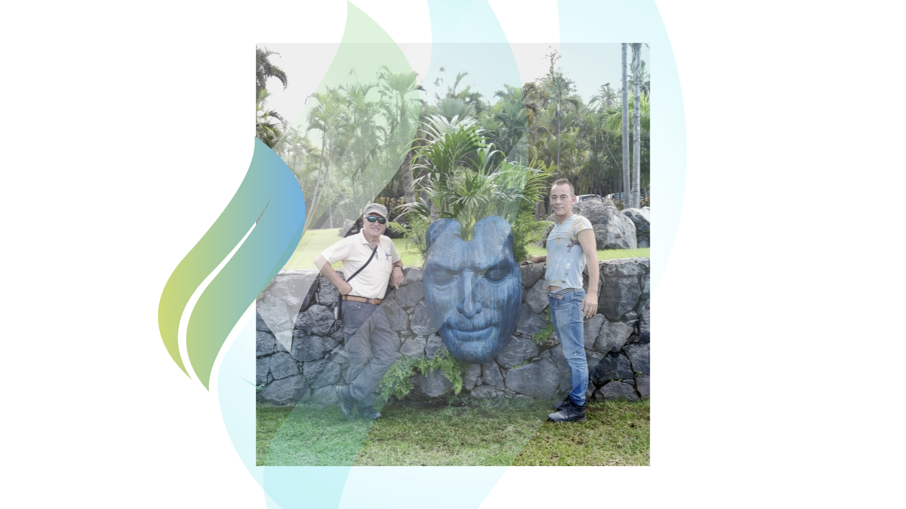
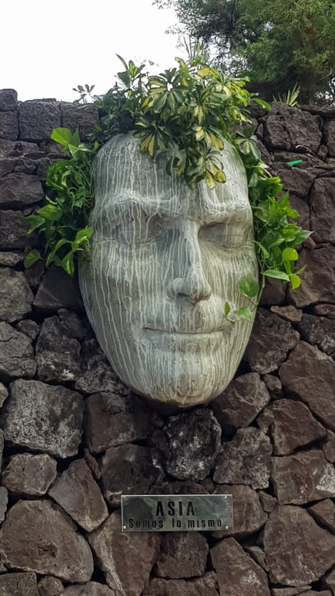
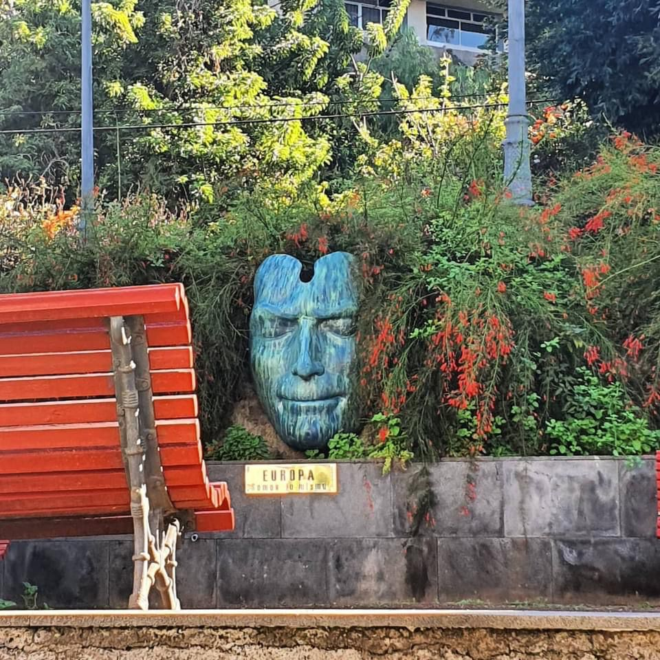
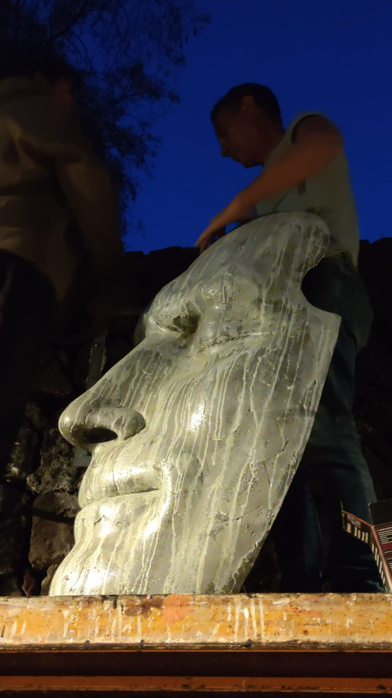
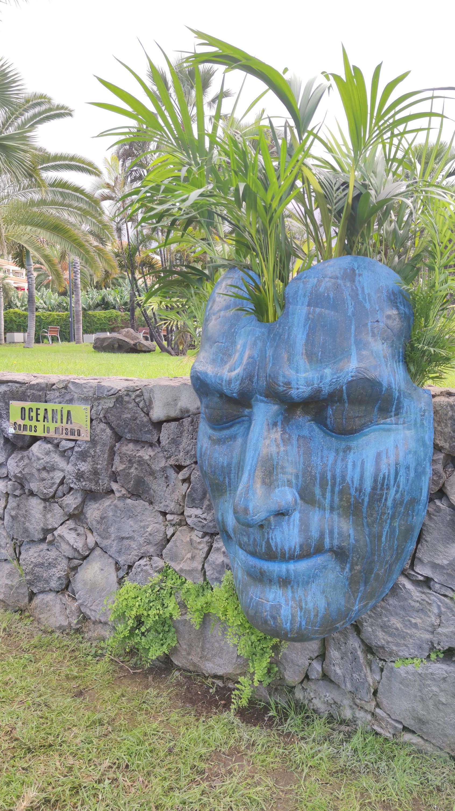
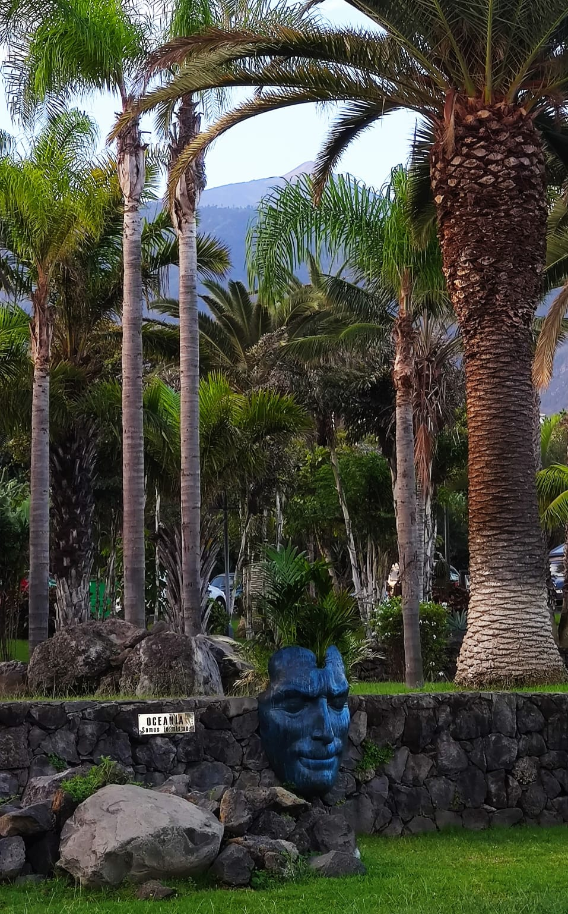

> Cada rostro de `Todos somos lo mismo' trata de unir a los habitantes de los
> cinco continentes a través de un recorrido urbano que crece y se transforma
> como un ser vivo. Un proyecto del artista vasco, afincado en Tenerife, que
> sueña con la diversidad cultural y la integración de las personas.

  

Arte para romper fronteras. Arte para cuestionar la intolerancia. Julio Nieto,
uno de los creadores con más proyección de Canarias, es el autor de Todos somos
lo mismo, un proyecto expositivo urbano que invita a descubrir los cinco
continentes a través de diferentes esculturas de rostros gigantes repartidos por
la ciudad de Puerto de la Cruz. Con una aparente sencillez, Nieto combina la
poética de las formas con elementos propios del juego y una profunda reflexión.

Las primeras tres caras de Todos somos lo mismo ya tienen nombre: Oceanía,
América y África, y están integradas en los muros y vegetación de diversos
espacios urbanos como son el Parque Taoro, Playa Jardín y Martiánez. Dos caras
que completarán la instalación, para sumar cinco piezas que representan al ser
humano; cinco continentes que simbolizan al mundo. "Representan las razas o
habitantes de estos cinco continentes; son una llamada a decir que por fin somos
lo mismo. Somos lo mismo si eres de África o si eres de Asia. Trata de unirnos
porque más allá de la piel somos idénticos", cuenta Nieto.

Realizadas en hormigón, las esculturas comparten la misma forma y rasgos, y en
su interior se han colocado diferentes especies vegetales oriundas de los
distintos continentes que con el tiempo van creciendo y formando la cabellera de
la cabeza. Son los propios ciudadanos y ciudadanas de los lugares donde se ha
instalado los que se encargan de sembrar, cuidar y regarlas. Como un ritual para
crear vínculos.

La intervención, de carácter efímero y sujeto a la participación, también invita
a quienes pasan ante ella a moverse alrededor y aplicar en las caras algo más
que el sentido de la vista. Un recorrido que juega con la ciudad y los
visitantes, en un agradable recorrido que incita a descubrir nuevas esculturas,
nuevos continentes y nuevos significados.

Todos somos lo mismo espera crecer con el tiempo hacia otras ciudades y países,
donde cobrarán vida estas esculturas con forma de rostro que simbolizan los
lazos entre países, donde recordarán sus orígenes en esta pequeña ciudad del
Atlántico
